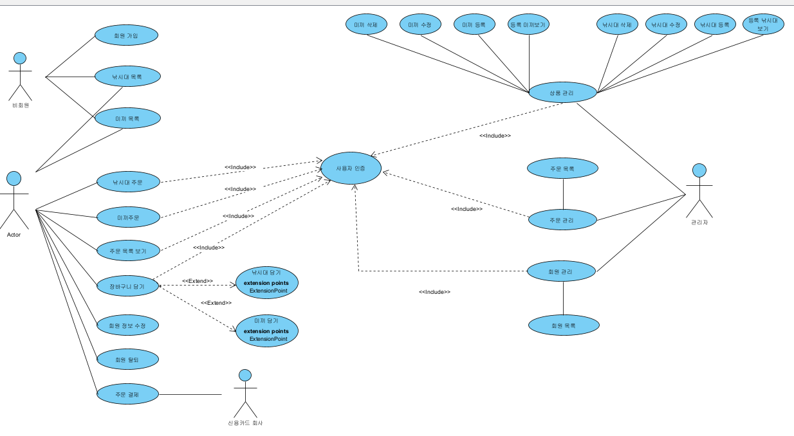
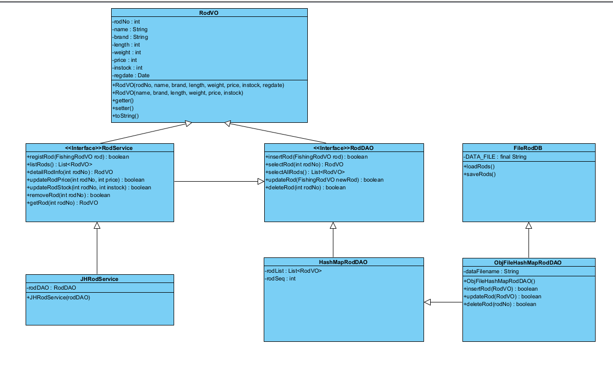
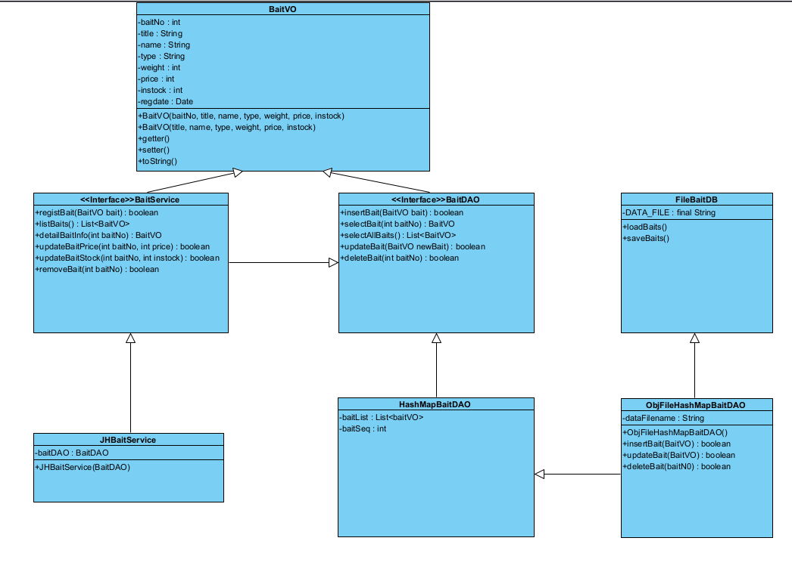
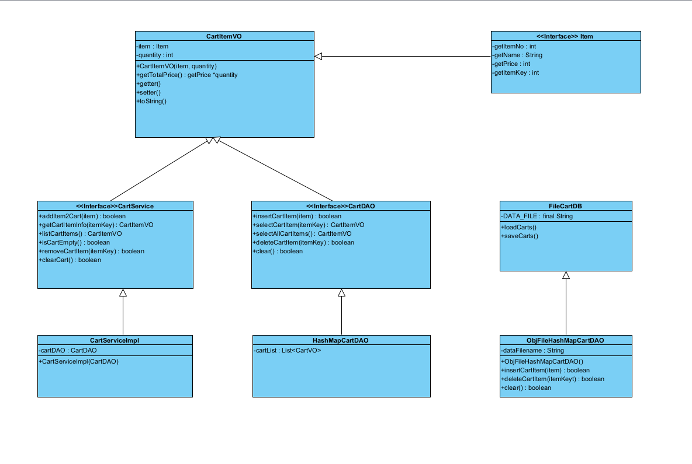
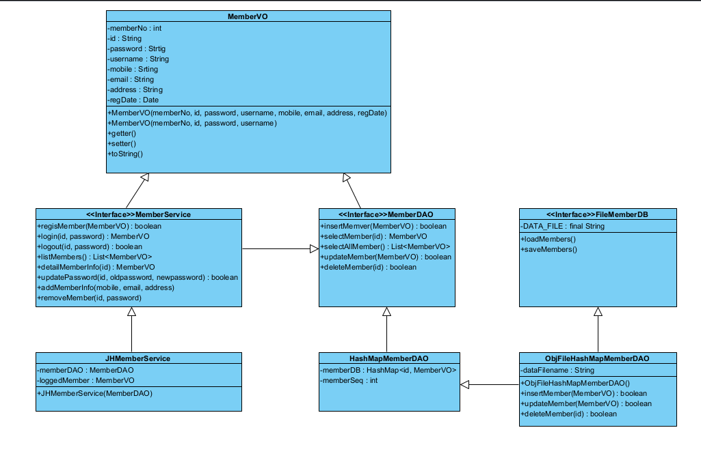
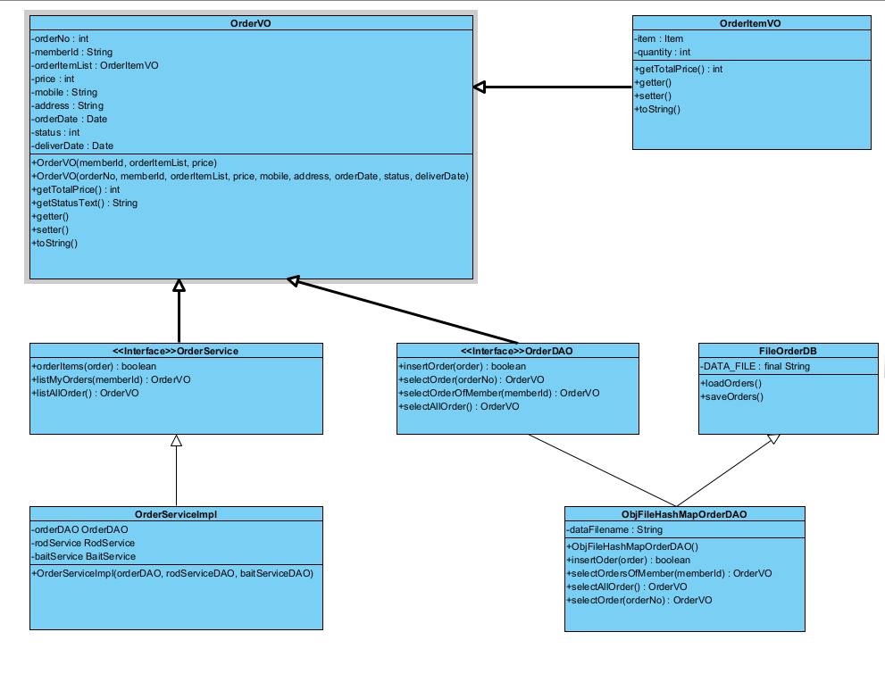

# 낚시 쇼핑 콘솔 애플리케이션 - FishingMartConsoleApp

FishingMartConsoleApp은 자바 콘솔 환경에서 동작하는 낚시용품 전문 쇼핑 애플리케이션입니다.  
회원가입부터 상품 탐색, 장바구니, 주문 및 배송 정보 관리까지 실제 쇼핑몰 흐름을 반영한 구조로 구현되어 있습니다.  
낚시대와 미끼 상품을 중심으로 사용자는 손쉽게 상품을 주문할 수 있으며,  
관리자는 상품과 주문을 효율적으로 관리할 수 있는 기능도 제공합니다.

---

##  프로젝트 개요

- 콘솔 기반 자바 애플리케이션으로, 객체지향 구조와 파일 저장 방식을 활용한 쇼핑 시스템입니다.
- 사용자/관리자 모드를 지원하며, 회원 관리부터 주문/배송까지의 흐름을 구현하였습니다.

---

##  주요 기능

**▶ 사용자 기능**
- 회원가입 / 로그인 / 내 정보 보기  
- 낚시대 목록 조회 및 주문  
- 미끼 목록 조회 및 주문  
- 장바구니 담기 / 보기  
- 주문 내역 확인 (배송지 포함)  
- 배송지 및 연락처 변경 가능  

**▶ 관리자 기능 (선택 구현)**
- 낚시대 및 미끼 상품 등록, 수정, 삭제  
- 전체 주문 내역 확인  

---
##  패키지 구조

```
src/
├── app/
│   ├── FishingMartConsoleApp.java       // 메인 실행 클래스
│   └── MyAppReader.java                 // 사용자 입력 처리 클래스
│
├── bait/                                // 미끼 관련 VO, DAO, Service
├── cart/                                // 장바구니 관련 VO, DAO, Service
├── fishfile/                            // 텍스트 기반 DAO 구현체
├── member/                              // 회원 관련 VO, DAO, Service
├── order/                               // 주문 관련 VO, DAO, Service
└── rod/                                 // 낚시대 관련 VO, DAO, Service
```


---

##  주요 클래스 설명

| 패키지    | 클래스명                                                   | 설명                    |
|-----------|------------------------------------------------------------|-------------------------|
| app       | `FishingMartConsoleApp`, `MyAppReader`                     | 메인 실행 및 입력 유틸      |
| bait      | `BaitVO`, `BaitDAO`, `BaitService` 등                       | 미끼 상품 관련 처리       |
| cart      | `CartItemVO`, `CartServiceImpl`, `HashMapCartDAO` 등       | 장바구니 기능 처리        |
| member    | `MemberVO`, `MemberService`, `MemberDAO` 등                 | 회원 정보 관리 처리       |
| order     | `OrderVO`, `OrderItemVO`, `OrderService`, `OrderDAO` 등     | 주문 및 주문 상세 처리     |
| rod       | `RodVO`, `RodService`, `RodDAO` 등                          | 낚시대 상품 관련 처리      |
| fishfile  | `TextFileHashMapRodDAO`, `TextFileHashMapBaitDAO` 등       | 텍스트 기반 DAO 구현체     |

---

##  개발 환경

- Java 17 이상  
- 콘솔 기반 애플리케이션  
- 객체 직렬화 기반 `.obj` 파일 저장 방식 사용  

---

##  전체 메뉴 흐름도

> 사용자와 관리자 메뉴의 흐름을 시각화한 다이어그램입니다.


---

##  유스케이스 다이어그램

> 주요 사용자 유형(회원, 관리자)의 행위를 모델링한 유스케이스 다이어그램입니다.



---

##  클래스 다이어그램

> 각 주요 도메인 객체의 구조를 나타낸 클래스 다이어그램입니다.

### 🎣 Rod 클래스  


### 🐛 Bait 클래스  


### 🛒 Cart 클래스  


### 👤 Member 클래스  


### 📦 Order 클래스  


---

### ✅ 1. 관리자 기능 시연

[

> 관리자 모드에서 상품 등록, 수정, 삭제등 기능 과정을 담은 시연입니다.

---

### ✅ 2. 사용자 기능 시연

[

> 사용자 모드에서 회원가입, 상품 탐색, 장바구니 담기, 주문 및 배송 정보 확인 과정을 담은 시연입니다.

